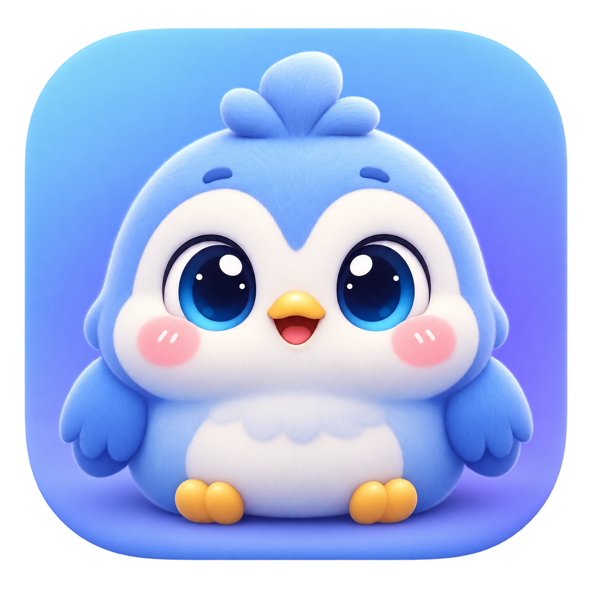
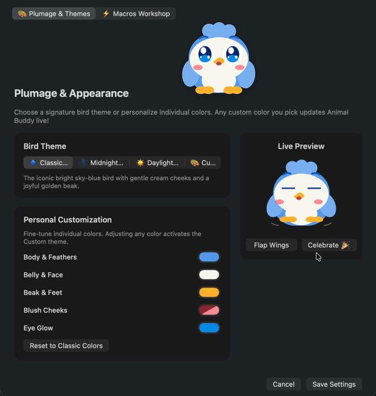

Please note that this AI-assisted project is in preliminary stages, and that there has been limited human oversight of the README and associated explanatory files. Closer to stable release dates, this information will be updated and human oversight will become more present.

If you have any concerns, feel free to raise them, and I will do my best to address them as quickly as possible.

Thank you for your interest in the project, and I hope your own projects bring you as much joy as Animal Buddy has brought me in creating it.

<div align="center">
  
  <h1>Animal Buddy</h1>
  <p>A tiny, cheerful macOS companion for useful drag-and-drop actions.</p>
</div>

Animal Buddy is a native macOS desktop pet that acts as a calm, physical-feeling drag-and-drop target for useful file actions. It stays above normal windows, understands dropped files and URLs, maps modifier keys to actions, and communicates progress through visual states.

## Theme showcase

See Animal Buddy’s theme settings in action:

[](Media/animal-buddy-theme-showcase.mov)

[Download the theme showcase video](Media/animal-buddy-theme-showcase.mov)

## Build and run

Requires macOS 13+ and Swift 6 (Apple Silicon development target). With the Swift command-line tools installed:

```sh
swift build
swift test
swift run AnimalBuddy
```

`swift run` launches an accessory app with a transparent floating pet window. Full Xcode is not required for the SwiftPM build; an Xcode project can be added later for signing and distribution.

On the current machine, `swift build -c release` succeeds. `swift test` is configured with XCTest but cannot run with the installed Command Line Tools alone because the XCTest module is supplied by the full Xcode installation; run it after installing/selecting Xcode.

## Architecture

- `Models`: input categories, modifier bindings, pet states, action context, and settings.
- `Services`: UTType/resource-value classification and JSON settings persistence.
- `Actions`: protocol-based actions and registry, independent of UI.
- `Pet`: state-driven creature rendering, eye tracking, and charm animations.
- `App`: AppKit application lifecycle and non-activating floating window/drop target.

`App/Info.plist` contains the minimal bundle metadata needed to package the SwiftPM executable as a local `.app` for desktop launching.
`App/AnimalBuddyIcon.png` and `App/AnimalBuddy.icns` contain the Animal Buddy app artwork used by both the Dock and menu-bar status item.

The drop layer classifies input, asks `ActionRegistry` for the binding matching `InputCategory + ModifierCombination`, then executes an action with an `ActionContext`. Pet assets can later be introduced behind the state model without changing automation code.

## 🛡️ macOS Gatekeeper & Installation Note

When downloading prebuilt `.app` application releases directly from the web or GitHub, macOS Gatekeeper automatically sets a quarantine attribute (`com.apple.quarantine`), displaying a warning that *"Animal Buddy is damaged and can't be opened"* on unsigned/ad-hoc signed builds.

To clear this on your Mac, open **Terminal** and run:

```sh
sudo xattr -rd com.apple.quarantine "/Applications/Animal Buddy.app"
```
*(or replace `/Applications/Animal Buddy.app` with the path to where you extracted the app)*.

---

## Current functionality

The `a0.66` release includes:

- **🎧 Music Companion: System-Wide Headphones & Dancing**: Automatically detects when music or audio is playing system-wide (YouTube, Spotify, Apple Music, podcasts, browsers, or any media output), putting cute DJ headphones on your pet and grooving along with rhythmic dance bounces and floating musical notes! Includes instant preview controls and a settings toggle.
- **HD 3D Gradient Sprites**: All 6 companions (Bird, Dog, Cat, Monkey, Giraffe, Slinky) upgraded with multi-stop 3D lighting, specular highlights, Disney/anime sparkle eyes, and species-specific physical accents (feather crests, collar pendants, tabby stripes, paw beans, horn spheres, wire reflection highlights).
- **Full-Name Animal & Theme Selectors**: Native vertical dropdown pickers in Settings that clearly show full animal and theme titles without truncation.
- **Help Me Focus & Just Cute Modes**: Your pet companion periodically makes adorable noises and presents an interactive floating speech bubble. In *Help Me Focus* mode, clicking the bubble transforms it into an inspiring focus reminder (e.g. *Back to work! 🎯*) with celebratory sparkles. In *Just Cute (For Nothing)* mode, clicking reveals warm, cheerful companion messages without work reminders.
- **Independent Audio Sound Effects Toggle**: Easily mute or unmute audio sound effects with 1 click directly from the menu bar or Settings checkbox without disabling visual speech bubbles.
- **Pre-Beta Codebase Audit & Size Reduction**: Binary size reduced by ~43% (symbol stripping and dead code removal) and app bundle footprint reduced by ~38%, with zero waste space.
- **Process Deadlock Prevention**: Hardened shell process execution to prevent pipe deadlocks on large standard error output.
- **Streamlined Menu Bar**: Clean, lightweight status menu with dynamic Show/Hide and direct access to Settings without visual clutter.
- **General Settings Tab**: Centralized hub for configuring the Desktop Inbox storage directory, window behavior, floating and snapping rules, helpful tips, and software updates.
- **Custom Desktop Inbox Location**: Choose any directory on your Mac for dropped files and snippets, with instant **Reveal in Finder** and **Reset to Default** actions.
- **Helpful Tips Speech Bubble**: Gentle educational tips float in a frosted glass speech bubble above your buddy while idle, with tap-to-navigate directly into the relevant Settings tab (disabled by default).
- **Expanded Macro Placeholders**: Drop macros now support `{{inbox}}` and `{{destination}}` placeholders in custom shell scripts and workflows.
- File, directory, image, URL, and text drops with visual drag feedback.
- Modifier-aware actions: Store in folder, Copy path, Reveal in Finder, Move to Trash, Convert to PNG, Optimise image, and Open URL.
- Safe collision handling for file writes and JSON-backed settings stored in `~/Library/Application Support/AnimalBuddy/settings.json`.
- A desktop buddy suite featuring Bird, Dog, Cat, Monkey, Giraffe, and Slinky characters. Each has its own themed palette and expressive details, with breathing, bobbing, independent idle movement, blinking, rosy cheeks, eye highlights, success sparkles, nearby mouse-tracking eyes, and characteristic motions.
- Slinky companion featuring animated coil physics, an authentic 6-tier Rainbow Spring skin, and spring-mounted pop-out Googly Eyes with gravity coordination and loose craft pupils.
- Automatic GitHub Update Checker with background startup checks, manual "Check for Updates…" controls, release notes presentation, and one-click download.
- Full-eye hit detection and standardized eye click macro triggers across all animal companions.
- A non-activating floating window that remains available across Spaces and does not take keyboard focus from the app being used. The regular app presence keeps Animal Buddy visible in the Dock and Force Quit Applications.
- Interactive link-clicking style pointing hand cursors when hovering over eye macro trigger spots and the minimize button.
- A hover-only minimize button and menu-bar controls for minimizing to the Dock or hiding while retaining the Animal Buddy menu-bar logo. The minimize animation respects reduced-motion preferences.
- Free placement after dragging, with optional “Snap to Screen Edges” behavior and subtle flick inertia.
- A proximity-based top/bottom dismiss target. Dragging the buddy towards the center edge of a screen shows the cross target; releasing within it hides or minimizes the buddy, while releasing outside restores it at the dropped location.
- A unified Macros workshop for configuring the left and right eye click buttons, plus drop-specific macros. Dragging macros can be assigned to images, folders, applications, files, URLs, text, mixed items, or unknown drops; they run before the normal drop action and can use `{{path}}`, `{{paths}}`, `{{text}}`, `{{category}}`, `{{inbox}}`, and `{{destination}}` placeholders. Macro blocks include shell commands, installed applications, URLs, Apple Shortcuts, and nested macros, with cycle protection.
- In-app macro suggestions, category-specific editing, and versioned macro import/export. The workshop exports a stable `com.animalbuddy.macros` JSON document and imports it atomically without changing themes or other settings.

Hover over the pet to reveal the minimize button. Use “Show Animal Buddy” from the status-item menu to bring it back after hiding it. Existing single-command macro settings migrate as shell blocks; Shortcut discovery requires the macOS Shortcuts helper service to be available in the logged-in user session.

### Macro file format

Macro exports use the versioned `com.animalbuddy.macros` JSON format. Version 1 contains `format`, `schemaVersion`, and `macros.blush`/`macros.drag` sections; each macro contains only a `name` and ordered `steps` array. Application settings and themes are not included. Unknown fields are ignored for additive compatibility, while unsupported schema versions are rejected. Existing settings continue to read legacy single-command macros.

## Limitations and roadmap

User-editable input bindings, pasteboard monitoring, sandbox entitlement and signing decisions, multi-pet packages, and script/plugin action extensions remain future work. Shortcut discovery depends on the macOS Shortcuts helper service. Destructive behavior uses macOS Trash, while file writes avoid overwrites.
